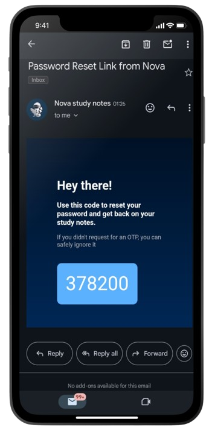

<center>

## NOVA - YouTube study notes generator

</center>

### Description:

Nova web application utilises youtube transcriptions and gpt 3.5 turbo to generate study notes corresponding to the user specified YouTube video.

Study notes follow a cornell structure comprising of,

1. Structured note
2. Cue questions (to improve recall to information)
3. Summary

<br/>
 
### Purpose: 
Generating study notes for solo and self learners from thier favourite YouTube sources.

<br />

## Dependencies

### Frontend

| runtime           | developement |
| ----------------- | ------------ |
| axios             | tailwind     |
| html-react-parser | prettier     |
| react-dom         | cypress      |
| react-router-dom  | eslint       |
| react-hot-toast   | vite         |
| react-icons  
| react-spinners

### Backend

| runtime               | developement |
| --------------------- | ------------ |
| bcrypt                | nodemon      |
| cors                  |
| dotenv                |
| express               |
| express-async-handler |
| jsonwebtoken  
| mongoose  
| node-fetch
| nodemailer
| youtube-transcript

## Pre-requisites and installation

- MongoDB Atlas connection string
- GPT 3.5 turbo API key
- NodeJS 16.x or above
- Google app password for enabling email

  <br />

1. clone the repo to your local development environment<br />
   `git clone https://github.com/lasanseniya/nova-web-app.git`

2. Install the packages in both frontend and backend via, <br />
   `npm install`

3. create .env files containing the following info,

   Frontend:

   ```
   VITE_API_KEY - gpt 3.5 turbo api key
   VITE_SERVER_URL - server url
   ```

   <br />

   Backend:

   ```
   PORT - port number
   CONNECTION_STRING - mongoDB atlas connection string
   ACCESS_TOKEN_SECRET - an access token secret
   FRONTEND_URL - frontend url
   EMAIL_FROM - email address
   EMAIL_PASSWORD - google app password from above email
   ```

4. start the dev backend server and frontend via, <br />
   `npm run dev`

<br />

## Tech Stack

<center>

[](https://skillicons.dev)

</center>
<br />

## Screenshots

<center>

### User Login and SignUp

 

### OTP send & verification

 

### Password reset



### Study note generation


### Note storage


</center>

<br />

## Contributors
<a href="https://github.com/lasanseniya"> @lasanseniya </a>

<a href="https://github.com/SavindiSilva"> @savindisilva </a>

<a href="https://github.com/Ranidhip"> @ranidhiperera </a>

<a href="https://github.com/chamathAn"> @chamathmunasinghe </a>

<a href="https://github.com/kusalpathirage"> @kusalpathirage </a>
